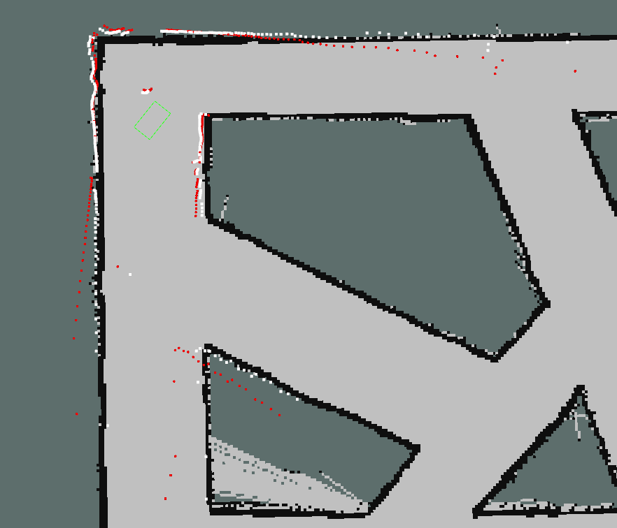
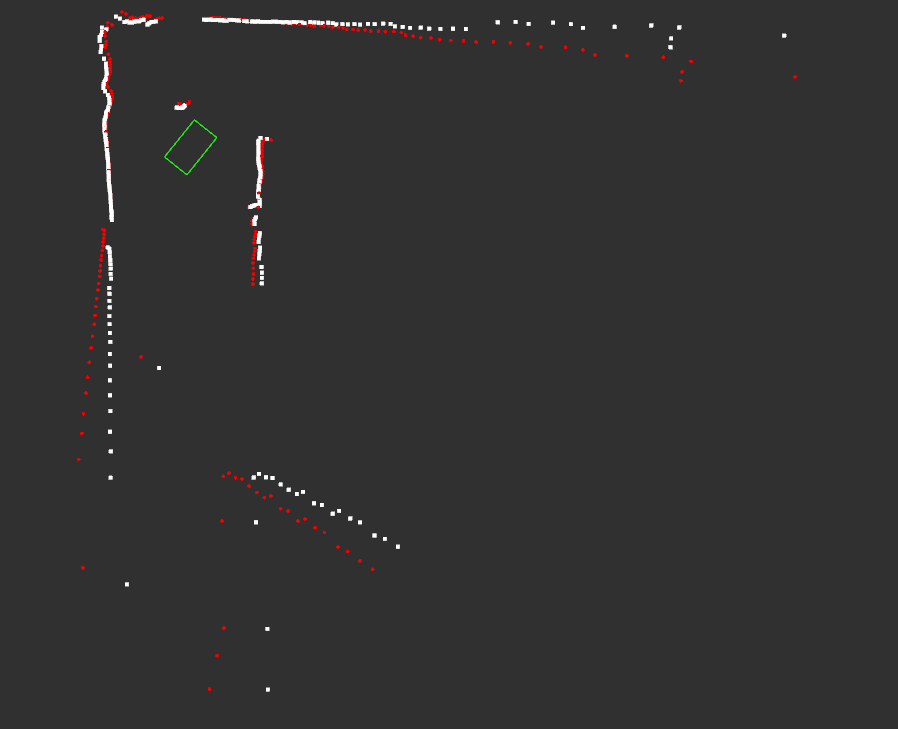

# 2d_lidar_undistortion

a ros package for lidar motion compensation

## Introduction

读取odom数据对2D激光雷达数据进行运动畸变校正。

This ros package uses odom transform data to correct motion distortion of a 2D LIDAR in real time。

## Result

  

在图片中，黄色方框代表机器人的位姿，红色点云代表原始的激光雷达数据，白色方框代表经过运动补偿后的激光雷达数据。

in this picture, the yellow rectangle represents the pose of robot, the red poindcloud represents the origin lidar data, and the white pointcloud represents the lidar data after compensation.

## Reference

https://github.com/elewu/2d_lidar_undistortion/

深蓝学院SLAM教程
